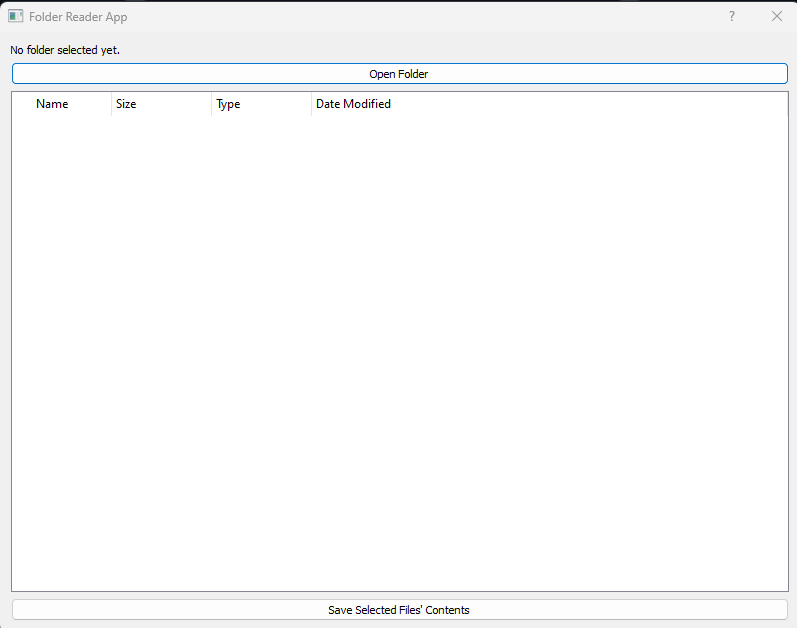
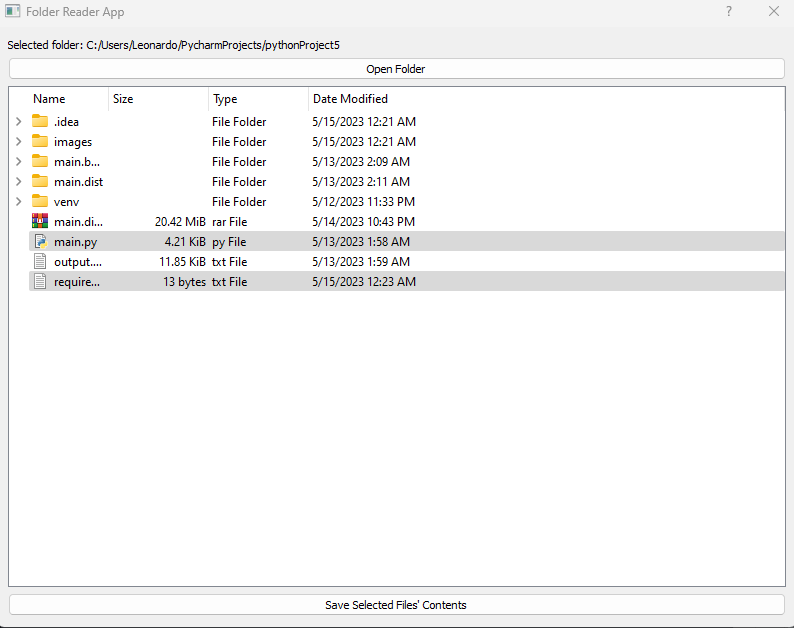

# 📁 Folder Reader App

This project is a Python application that allows you to select a directory and view its contents in a tree structure. It also allows you to save the structure of a folder alongside the contents of selected files into an output file. The application is built with PyQt5.


 

## 🛠️ Prerequisites

Ensure that you have Python 3.8 or above installed on your machine. You can download Python [here](https://www.python.org/downloads/). 

## 🚀 Installation

Follow the steps below to set up the project on your local machine:

1. Clone this repository:
    ```bash
    git clone https://github.com/leonardosblang/folder_reader.git
    ```

2. Navigate to the project directory:
    ```bash
    cd folder_reader
    ```

3. Create a virtual environment (Optional but recommended):
    ```bash
    python3 -m venv env
    ```
    Activate the virtual environment:
    - On Windows: `.\env\Scripts\activate`
    - On Unix or MacOS: `source env/bin/activate`

4. Install the required packages:
    ```bash
    pip install -r requirements.txt
    ```

## 🕹️ Running the Application

You can run the application with the following command:

```bash
python main.py
 ```
 The application window will open. You can select a directory by clicking on the "Open Folder" button. The contents of the directory will be displayed in a tree structure. You can select specific files and click on the "Save Selected Files' Contents" button to save their contents to an output.txt file.
 
